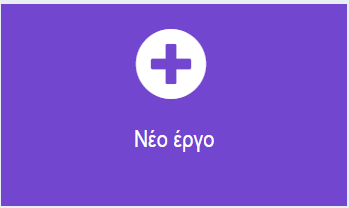

## Η ιδέα σου

Χρησιμοποίησε αυτό το βήμα για να σχεδιάσεις το παιχνίδι για το πάρτι σου. Μπορείς να σχεδιάσεις με το μυαλό σου, μαστορεύοντας, σχεδιάζοντας ή γράφοντας, ή όπως θέλεις!

### Τι θα φτιάξεις;

\--- task ---

Σκέψου το παιχνίδι για το οποίο θα χρησιμοποιήσεις το micro:bit σου.

- Ποιοι είναι οι κανόνες του παιχνιδιού;
- Πώς κερδίζει κάποιος/α;
- Υπάρχουν επιλογές που πρέπει να κάνουν οι παίκτες;
- Συγκεντρώνουν πόντους οι παίκτες;
- Το παιχνίδι θα παίζεται εντός ή εκτός;

\--- /task ---

### Σε ποιον/α απευθύνεται;

\--- task ---
Σκέψου για ποιους θα φτιάξεις το παιχνίδι για το πάρτι (το **κοινό** σου).

- Θα χρειαστούν περισσότερο χρόνο για να δουν τα εικονίδια ή το κείμενο στην οθόνη;
- Θα χρειαστούν ήχο καθώς και οπτικές πληροφορίες;
- Θα είναι σε θέση να καταλάβουν τι σημαίνει ένα εικονίδιο;
- Υπάρχει κάποιο μέρος του micro:bit που μπορεί να είναι δύσκολο να χρησιμοποιηθεί;

\--- /task ---

### Ξεκίνησε

Χρησιμοποίησε μια εφαρμογή για σημειώσεις ή στυλό και χαρτί, ή και τα δύο, για να σχεδιάσεις ιδέες για το παιχνίδι σου.

Προσπάθησε να σημειώσεις όσες περισσότερες ιδέες μπορείς και συζήτησέ τις με έναν/μια φίλο/η.

Στη συνέχεια επίλεξε την ιδέα που σου αρέσει περισσότερο.

\--- task ---

Άνοιξε το πρόγραμμα επεξεργασίας MakeCode στη διεύθυνση [makecode.microbit.org](https://makecode.microbit.org){:target="_blank"}.

\--- collapse ---

---

## title: Εκτός σύνδεσης έκδοση του επεξεργαστή

Υπάρχει επίσης μια [έκδοση του προγράμματος επεξεργασίας MakeCode με δυνατότητα λήψης](https://makecode.microbit.org/offline-app){:target="_blank"}.

\--- /collapse ---

\--- /task ---

Μόλις ανοίξει το πρόγραμμα επεξεργασίας, δημιούργησε ένα νέο έργο και δώσε ένα όνομα στο έργο σου.

\--- task ---

Κάνε κλικ στο κουμπί **Νέο έργο**.

\--- /task ---

\--- task ---

Δώσε στο έργο σου ένα όνομα που να ταιριάζει στο παιχνίδι για πάρτι που θέλεις να φτιάξεις!

**Συμβουλή:** Εάν δώσεις στο έργο σου ένα όνομα που σχετίζεται με το παιχνίδι που δημιουργείς, θα είναι πιο εύκολο να το βρίσκεις εάν δημιουργήσεις και άλλα έργα στο MakeCode.

\--- /task ---

Το παιχνίδι σου θα πρέπει να χρησιμοποιεί μερικές λειτουργίες micro:bit. Εδώ είναι μερικά συστατικά που μπορεί να σας φανούν χρήσιμα.

#### Βρόχοι

[[[microbit-forever-loop]]]

[[[microbit-repeat]]]

[[[microbit-for-loop]]]

#### Μεταβλητές

[[[microbit-create-variables]]]

#### Λογική

[[[microbit-selection]]]
