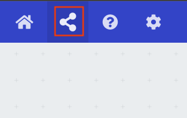
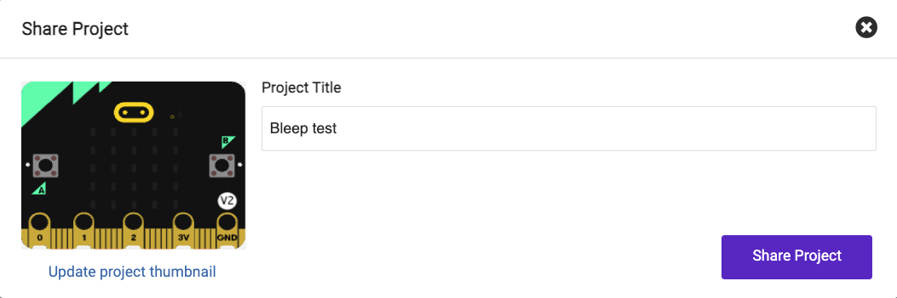
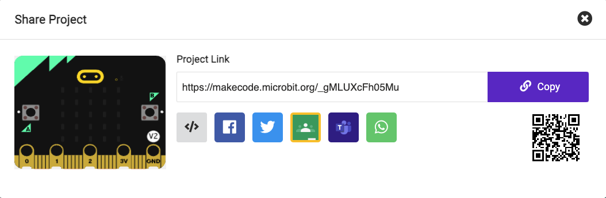

## Share and play

If you are in a club, why not share your project with friends?

You could also show your family how your project works.

You can share your project through MakeCode. You can send a link to people you know!

--- collapse ---

---
title: How to share your project in MakeCode
---

In the top bar of MakeCode, there is a share button you can use to get a link to your project.

Click the share button, and check the name of your project. 

Click **Share Project**.

You will be presented with a link that you can send to anyone to share your project! 

--- /collapse ---

--- task ---

Inspire the Raspberry Pi Foundation community with your project!

To submit your project please complete [this form](https://form.raspberrypi.org/f/community-project-submissions){:target="_blank"} and share your project link with us!

It might be featured on the first page of this project for others to get inspiration from.

--- /task ---