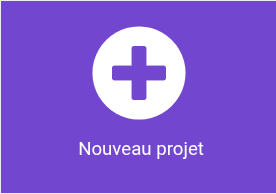

## Ton idée

Utilise cette étape pour planifier ton jeu de société. Tu peux planifier simplement en pensant, en bricolant, en dessinant ou en écrivant, ou comme bon te semble !

### Que vas-tu faire ?

--- task ---

Pense au jeu pour lequel tu utiliseras ton micro:bit.

- Quelles sont les règles du jeu ?
- Comment une personne peut‑elle gagner ?
- Les joueur·euse·s doivent-iels faire des choix ?
- Les joueur·euse·s marquent-iels des points ?
- Le jeu sera-t-il joué à l'intérieur ou à l'extérieur ?

--- /task ---

### À qui s'adresse-t-il ?

--- task ---
Pense pour qui tu vas créer ton jeu de société (ton **public**).

- Auront-iels besoin de plus de temps pour voir les icônes ou le texte à l’écran ?
- Auront-iels besoin d’informations sonores et visuelles ?
- Pourront-iels comprendre ce que signifie une icône ?
- Y a-t-il une partie du micro:bit qu'ils ou elles pourraient trouver difficile à utiliser ?

--- /task ---

### Commencer

Utilise une application de notes ou un stylo et du papier, ou les deux, pour planifier des idées pour ton jeu.

Essaie de noter autant d'idées que possible et discute-les avec un·e ami ·e.

Ensuite, choisis l'idée qui te plaît le plus.

--- task ---

Ouvre l'éditeur MakeCode sur [makecode.microbit.org](https://makecode.microbit.org){:target="_blank"}.

--- collapse ---

---
title: Version hors ligne de l'éditeur
---

Il existe également une [version téléchargeable de l'éditeur MakeCode](https://makecode.microbit.org/offline-app){:target="_blank"}.

--- /collapse ---

--- /task ---

Une fois que l'éditeur est ouvert, crée un nouveau projet et donne un nom à ton projet.

--- task ---

Clique sur le bouton **Nouveau projet**.

--- /task ---

--- task ---

Donne à ton projet un nom qui correspond au jeu de société que tu souhaites créer !

**Conseil :** donner à ton projet un nom lié au jeu que tu crées le rendra plus facile à retrouver si tu crées d'autres projets sur MakeCode.

--- /task ---

Ton jeu devra utiliser certaines fonctionnalités du micro:bit. Voici quelques ingrédients qui pourraient t'être utiles.

#### Boucles

[[[microbit-forever-loop]]]

[[[microbit-repeat]]]

[[[microbit-for-loop]]]

#### Variables

[[[microbit-create-variables]]]

#### Logique

[[[microbit-selection]]]
