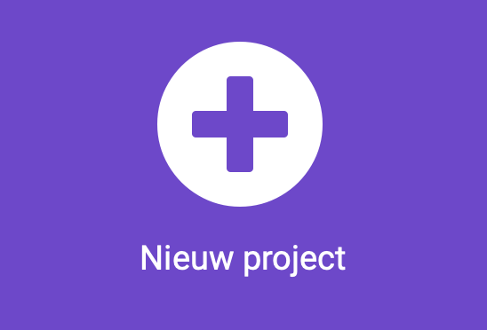

## Jouw idee

Gebruik deze stap om je gezelschapsspel te plannen. Je kunt het plannen door erover na te denken, te knutselen, te tekenen of te schrijven, of hoe je maar wilt!

### Wat ga je maken?

\--- task ---

Denk na over het spel waarvoor je je micro:bit gaat gebruiken.

- Wat zijn de spelregels?
- Hoe wint iemand?
- Zijn er keuzes die spelers moeten maken?
- Scoren de spelers punten?
- Wordt het spel binnen of buiten gespeeld?

\--- /task ---

### Voor wie is het?

\--- task ---
Bedenk voor wie je je gezelschapsspel gaat maken (je **publiek**).

- Hebben ze langer nodig om de pictogrammen of tekst op het scherm te zien?
- Hebben ze zowel geluids- als visuele informatie nodig?
- Kunnen ze begrijpen wat een pictogram betekent?
- Zijn er onderdelen van de micro:bit die ze misschien moeilijk kunnen gebruiken?

\--- /task ---

### Aan de slag

Gebruik een notitie-app of pen en papier, of beide om ideeën voor je spel te plannen.

Probeer zoveel mogelijk ideeën te bedenken en bespreek ze met een vriend.

Kies dan het idee dat je het meest bevalt.

\--- task ---

Open de MakeCode editor in [makecode.microbit.org](https://makecode.microbit.org){:target="_blank"}.

\--- collapse ---

---

## title: Offline versie van de editor

Er is ook een [downloadbare versie van de MakeCode-editor](https://makecode.microbit.org/offline-app){:target="_blank"}.

\--- /collapse ---

\--- /task ---

Zodra de editor is geopend, moet je een nieuw project aanmaken en je project een naam geven.

\--- task ---

Klik op de knop **Nieuw project**.

\--- /task ---

\--- task ---

Geef je project een naam die past bij het gezelschapsspel dat je wilt maken!

**Tip:** als je je project een naam geeft met betrekking tot het spel dat je maakt, is het gemakkelijker om het later terug te vinden als je nog andere projecten aanmaakt op MakeCode.

\--- /task ---

Je spel zal een aantal functies van de micro:bit gebruiken. Hier zijn enkele ingrediënten die je nuttig zou kunnen vinden.

#### Lussen

[[[microbit-forever-loop]]]

[[[microbit-repeat]]]

[[[microbit-for-loop]]]

#### Variabelen

[[[microbit-create-variables]]]

#### Logica

[[[microbit-selection]]]
